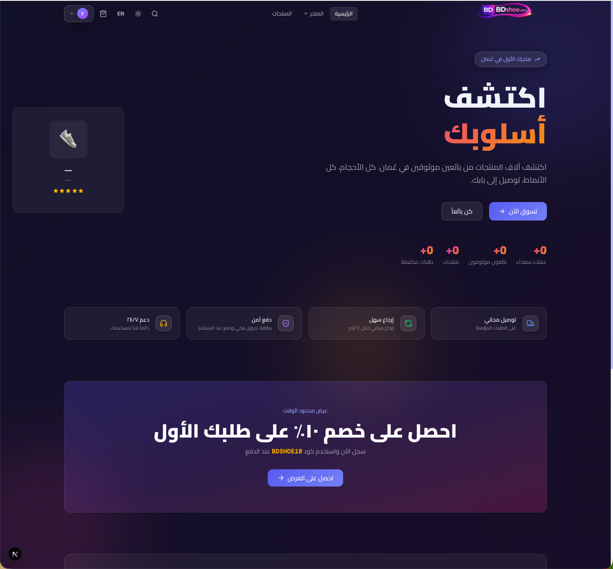
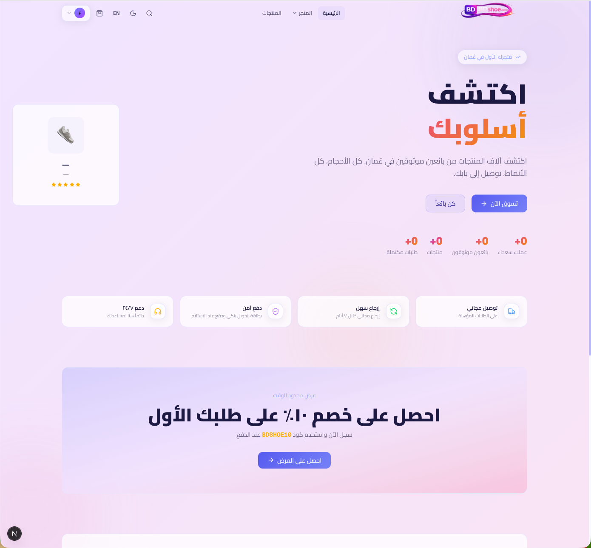
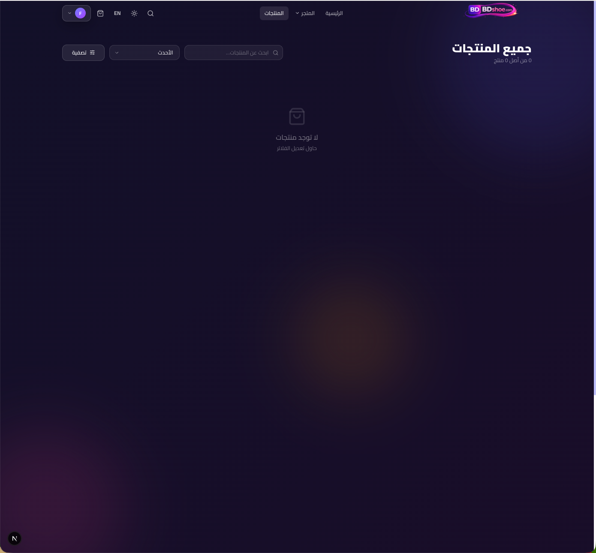
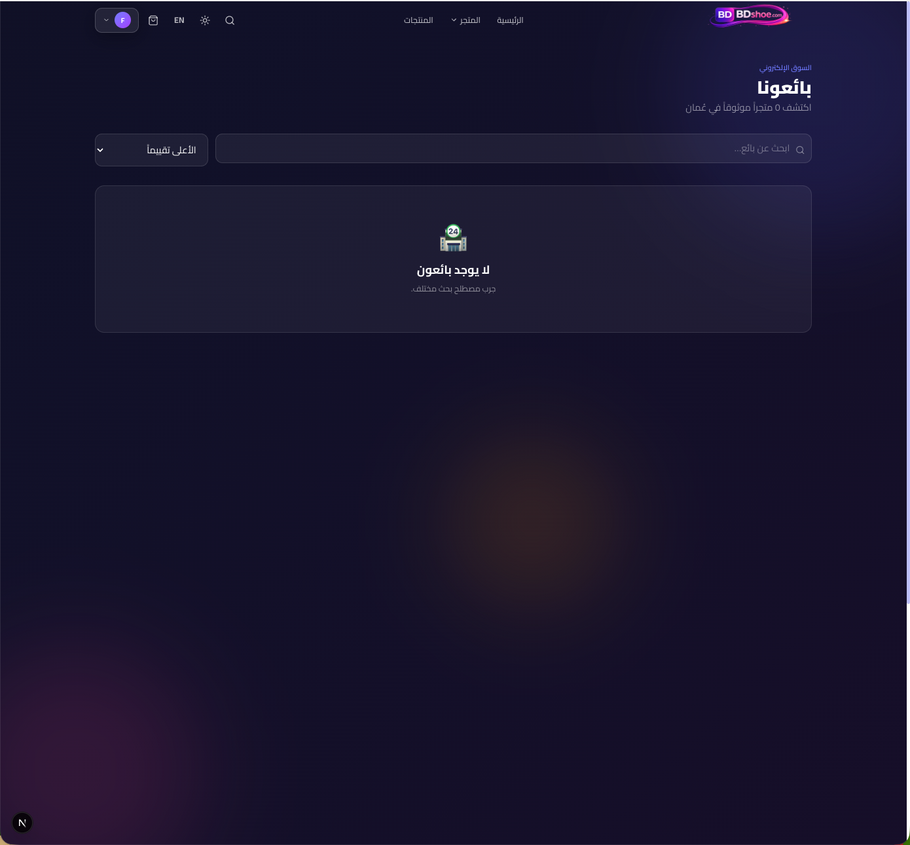
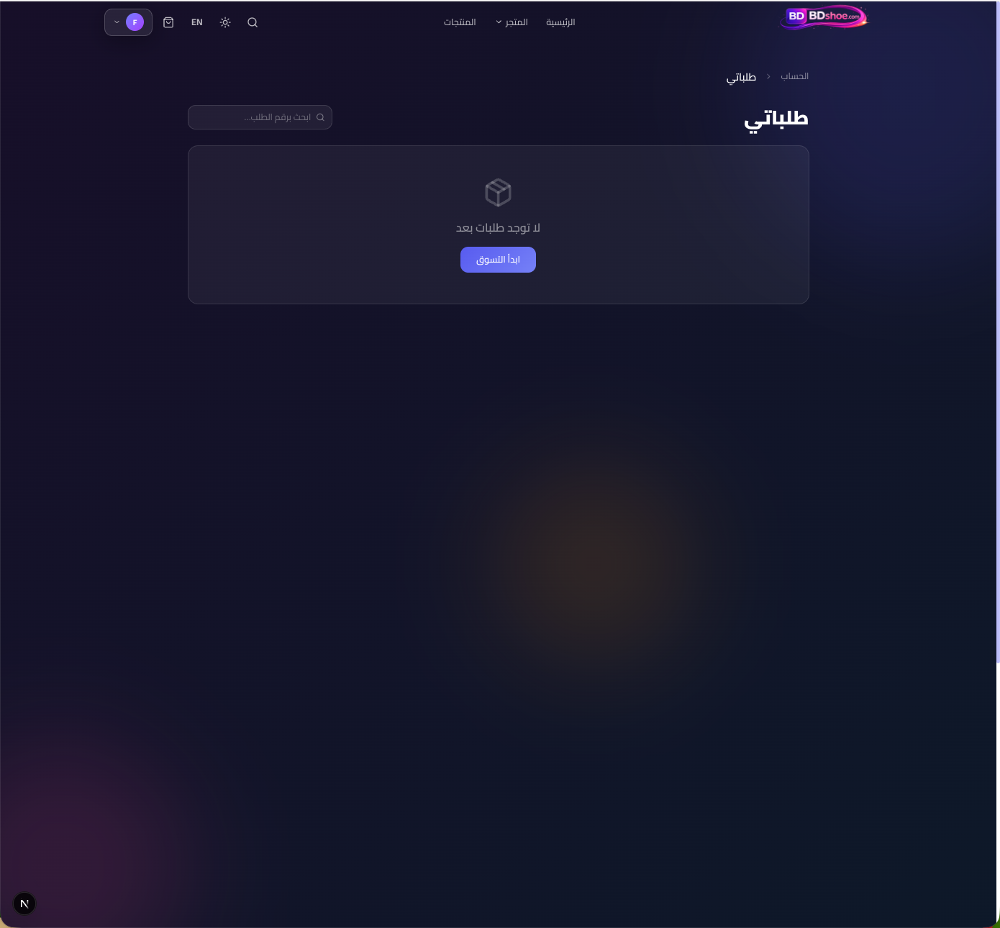
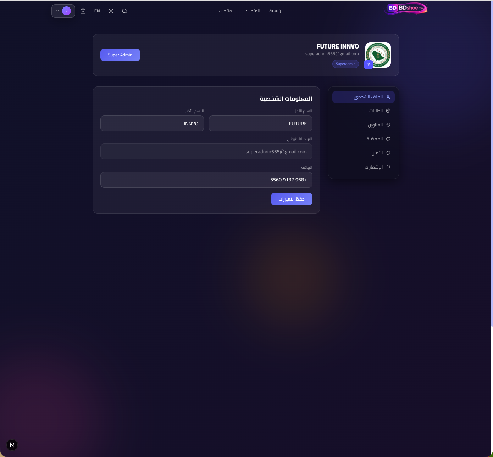
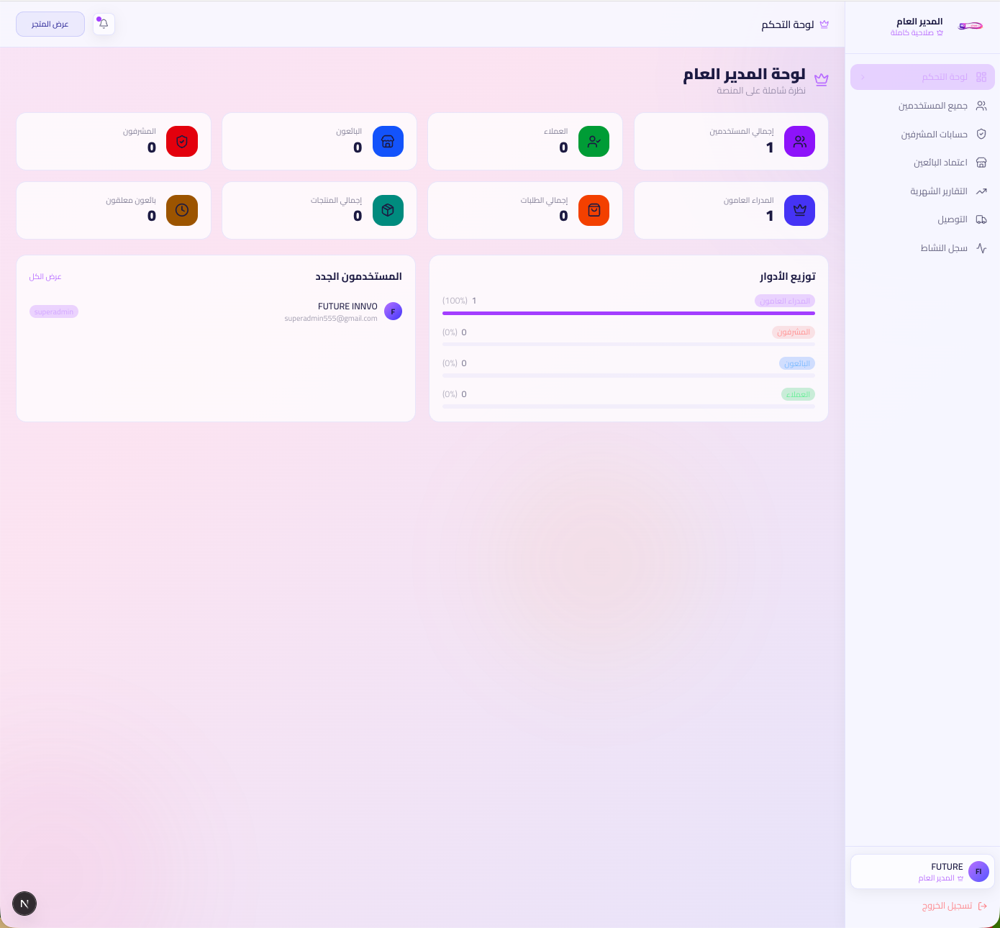
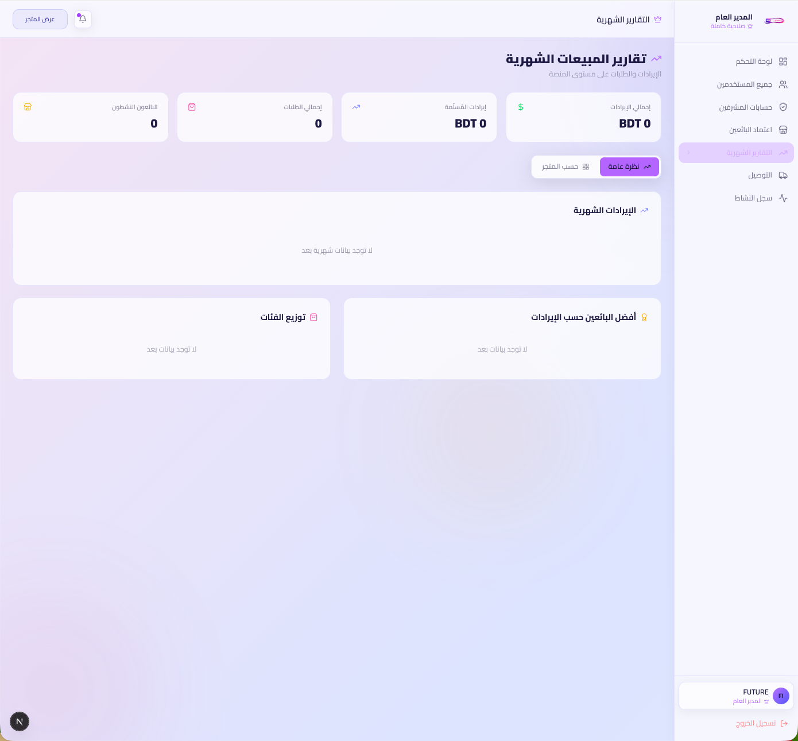
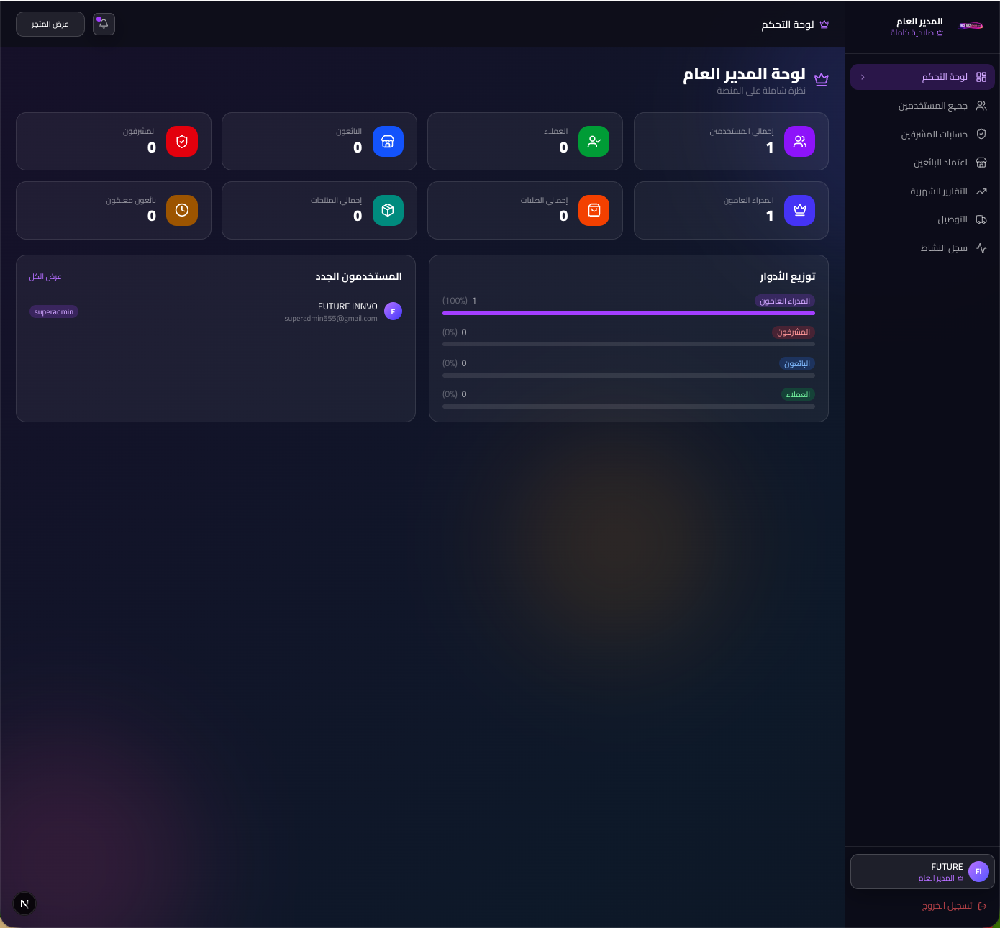

<div align="center">


# Souq Al Qadam — سوق القدم

### Oman's Premier Multi-Vendor Shoe Marketplace

[](https://nextjs.org/)
[](https://www.django-rest-framework.org/)
[](https://flutter.dev/)
[](https://www.docker.com/)
[](LICENSE)

</div>

---

## Overview

**Souq Al Qadam** is a full-stack, bilingual (Arabic 🇴🇲 / English 🇬🇧) multi-vendor e-commerce platform built for the Omani shoe market. Vendors can register, list products, and manage orders — while customers browse, wishlist, and purchase from multiple shops in one place.

---

## Features

### 🛍️ Customer
- Browse products with infinite scroll, filters (size, price, category), and sorting
- Vendor storefronts with ratings and product listings
- Cart, Wishlist, and Checkout (Card / COD)
- Order tracking with progress steps (Placed → Processing → Shipped → Delivered)
- Invoice download / print
- Account management with address book

### 🏪 Vendor
- Vendor registration & approval workflow
- Product management (create, edit, bulk CSV upload)
- Order & delivery management
- Revenue reports and commission breakdown
- Vendor settings & profile

### 🛡️ Admin
- Full platform management: products, orders, vendors, customers
- Category & commission configuration
- Monthly sales analytics with charts
- Site settings (logo, contact, social links)

### 👑 Super Admin
- Approve / reject / suspend vendor applications
- Mark shops as Premium ✨
- User role management (Customer → Vendor → Admin → Super Admin)
- Admin account creation
- Platform-wide revenue reports by shop
- Activity logs & delivery reports

### 🌐 Bilingual & RTL
- Full Arabic / English support with instant language switching
- Tailwind CSS logical properties for seamless RTL layout
- Cairo font for Arabic text

---

## Tech Stack

| Layer | Technology |
|---|---|
| Frontend | Next.js 16 (App Router), TypeScript, Tailwind CSS v4 |
| State | Zustand, TanStack Query |
| Backend | Django 5, Django REST Framework, Celery |
| Database | PostgreSQL |
| Cache / Queue | Redis |
| Mobile | Flutter (Dart) |
| DevOps | Docker Compose, Nginx |

---

## Project Structure

```
Souq_AL_Qadam/
├── backend/                  # Django REST API
│   ├── apps/
│   │   ├── users/            # Auth, roles, addresses
│   │   ├── vendors/          # Vendor profiles, approval, premium
│   │   ├── products/         # Products, categories, images
│   │   ├── orders/           # Orders, order items
│   │   ├── cart/             # Cart management
│   │   ├── reviews/          # Product reviews & ratings
│   │   └── payments/         # Payment records
│   ├── config/               # Django settings (base/dev/prod)
│   └── requirements/
├── frontend/                 # Next.js application
│   └── src/
│       ├── app/
│       │   ├── (store)/      # Customer-facing pages
│       │   ├── (auth)/       # Login & Register
│       │   ├── vendor/       # Vendor dashboard
│       │   ├── admin/        # Admin panel
│       │   └── superadmin/   # Super Admin panel
│       ├── components/       # Navbar, Footer, CartDrawer, etc.
│       ├── lib/              # API client, i18n translations
│       └── store/            # Zustand stores
├── mobile/                   # Flutter mobile app
├── nginx/                    # Nginx reverse proxy config
├── docker-compose.yml        # Development stack
└── docker-compose.prod.yml   # Production stack
```

---

## Getting Started

### Prerequisites
- Docker & Docker Compose
- Node.js 20+
- Python 3.12+

### 1. Clone the repository
```bash
git clone https://github.com/Arman170616/Souq_AL_Qadam.git
cd Souq_AL_Qadam
```

### 2. Configure environment variables
```bash
# Backend
cp backend/.env.example backend/.env
# Edit backend/.env with your SECRET_KEY, DB credentials, etc.

# Frontend
cp frontend/.env.example frontend/.env.local
# Set NEXT_PUBLIC_API_URL=http://localhost:8000/api/v1
```

### 3. Run with Docker
```bash
docker-compose up --build
```

| Service | URL |
|---|---|
| Frontend | http://localhost:3000 |
| Backend API | http://localhost:8000/api/v1 |
| Django Admin | http://localhost:8000/admin |

### 4. Run manually (development)

**Backend**
```bash
cd backend
python -m venv .venv && source .venv/bin/activate
pip install -r requirements/dev.txt
python manage.py migrate
python manage.py createsuperuser
python manage.py runserver
```

**Frontend**
```bash
cd frontend
npm install
npm run dev
```

---

## User Roles

| Role | Access |
|---|---|
| **Customer** | Browse, cart, checkout, orders, account |
| **Vendor** | Own shop dashboard, products, orders, reports |
| **Admin** | Platform management (products, orders, customers, vendors) |
| **Super Admin** | Full access including vendor approvals and admin management |

---

## Screenshots

### 🏠 Home Page
<div align="center">


</div>

### 🛍️ Customer Pages
<div align="center">


</div>

<div align="center">


</div>

### 🛡️ Admin Panel
<div align="center">


</div>

### 👑 Super Admin Panel
<div align="center">

</div>

---

## License

This project is licensed under the [MIT License](LICENSE).

---

<div align="center">
  <strong>Souq Al Qadam</strong> · سوق القدم · Built with ❤️ for Oman
</div>
